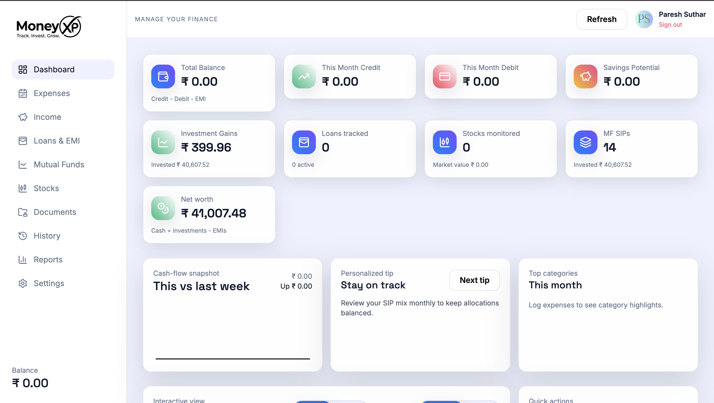
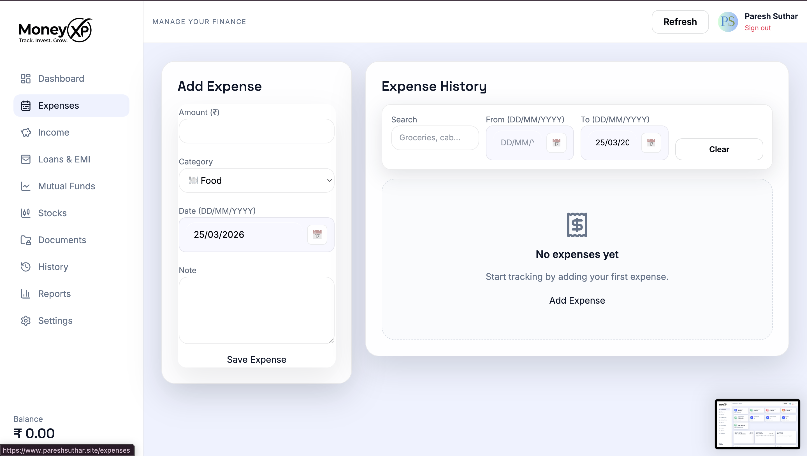
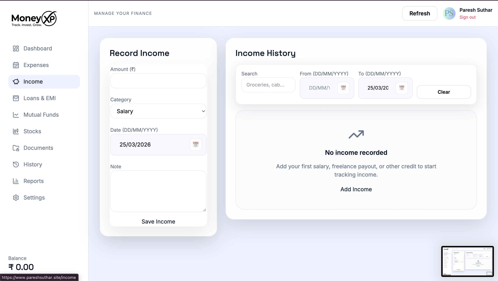
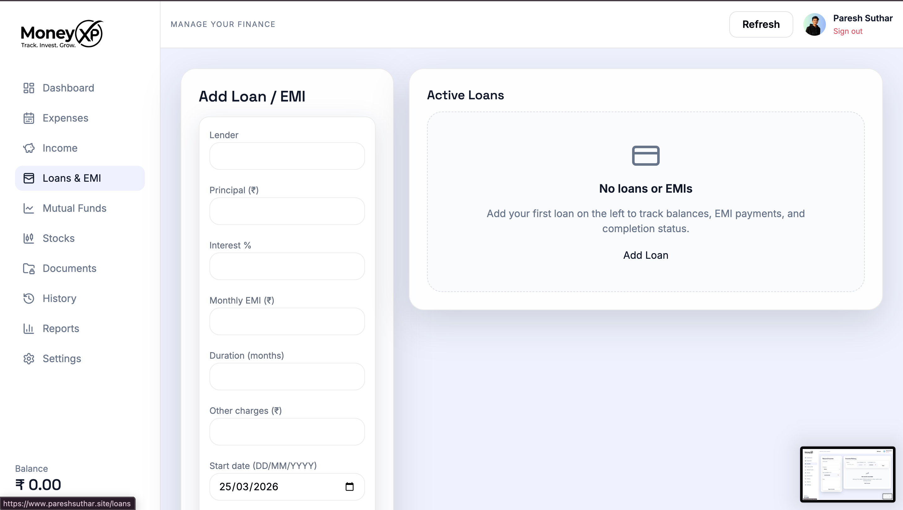
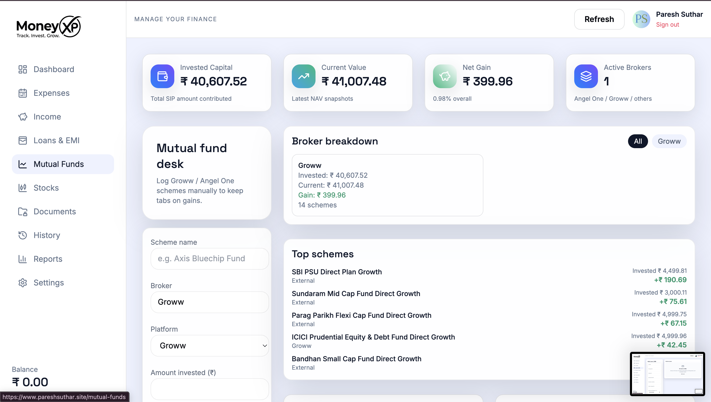
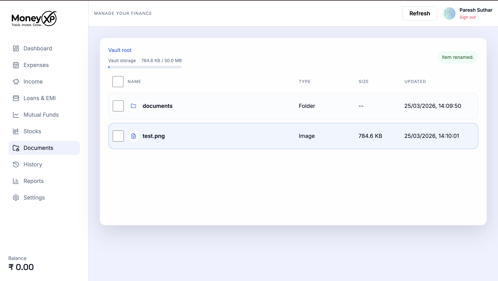
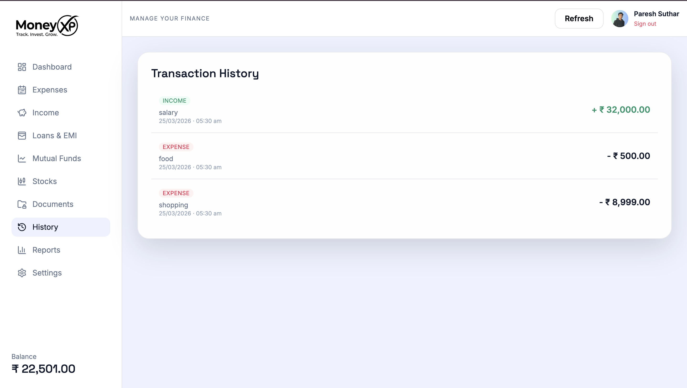
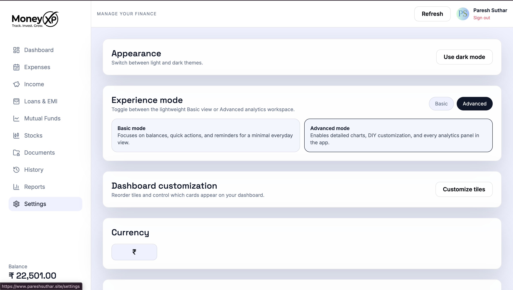
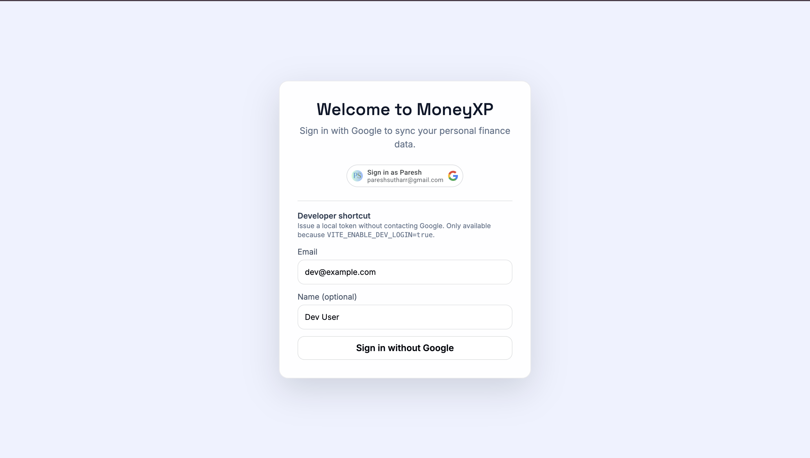

# MyPrice Frontend

React 19 + Vite frontend for MyPrice / MoneyXP.

This app powers the dashboard, finance forms, reports, document vault, banks MVP, and ITR estimation experience.

## Run locally

```bash
npm install
npm run dev
```

Default dev server:

```text
http://localhost:5173
```

## Environment

Create `frontend/.env`:

```env
VITE_API_URL=http://localhost:4000/api
VITE_GOOGLE_CLIENT_ID=your_google_client_id
VITE_ENABLE_DEV_LOGIN=true
```

## Build

```bash
npm run build
```

## Main areas

- Dashboard
- Expenses
- Income
- Loans & EMI
- Mutual Funds / Investments
- Documents vault
- History
- Reports
- Settings
- Banks
- ITR Filing

## Screenshots

### Dashboard



### Expenses



### Income



### Loans & EMI



### Mutual Funds



### Documents



### History



### Settings



<details>
<summary>Login screen</summary>



</details>

## Full project docs

See the root project readme:

- [`../README.md`](../README.md)
